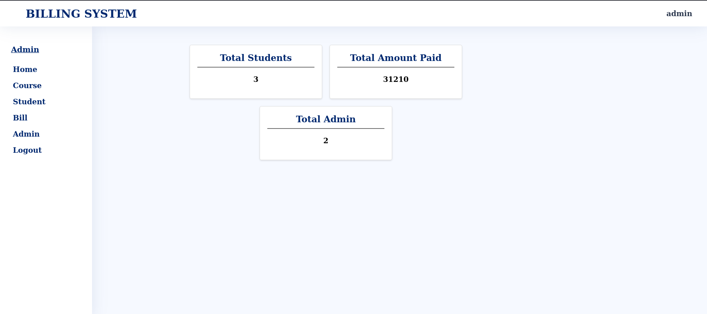

# Institute Billing System

## Introduction
The Institute Billing System is a software solution designed to streamline the billing process within your institute. This system automates fee calculations, invoice generation, and payment tracking, providing a more efficient and accurate way to manage financial transactions. This README provides an overview of the system, its features, and instructions for getting started.

## Features
- Automated fee calculations based on predefined fee structures.
- Invoice generation and delivery to students and parents.
- Comprehensive reporting and analytics for financial management.
- Tracking of Fee Payment.
- User-friendly interface for easy navigation and use.

## Getting Started

### Prerequisites

Before you begin, ensure you have met the following requirements:

- Must Have MacOS/Windows OS/Linux OS
- Must Installed PHP
- Must Installed mySQL Database and Apache Server

  Note: If you have Installed XAMPP in your local Machine. It will Automatically Contains PHP, mySQL Database and Apache Server.


### Usage
- Run the Server and Database in your Local Machine.
- Create a Database name with `BillingSystem`;
```sql
CREATE DATABASE BillingSystem;
```
- Create the User With Username `user` and Password `user`
```sql
CREATE  USER 'user'@'localhost' IDENTIFIED BY "user";
```
- Grant all the Permission on the  `BillingSystem` Database to the Created User.
```sql
GRANT ALL PRIVILEGES ON BillingSystem.* TO 'user'@'localhost';
```
- Execute all the Command of `assets/database/BillingSystem.sql` from `localhost/phpmyadmin`
- Now, Open the project in your local system.
```url
http://localhost/Institute-Billing-System
 ```

### Login Details
- Admin User/Super User
  - Username: `admin`,  Password: `admin`
